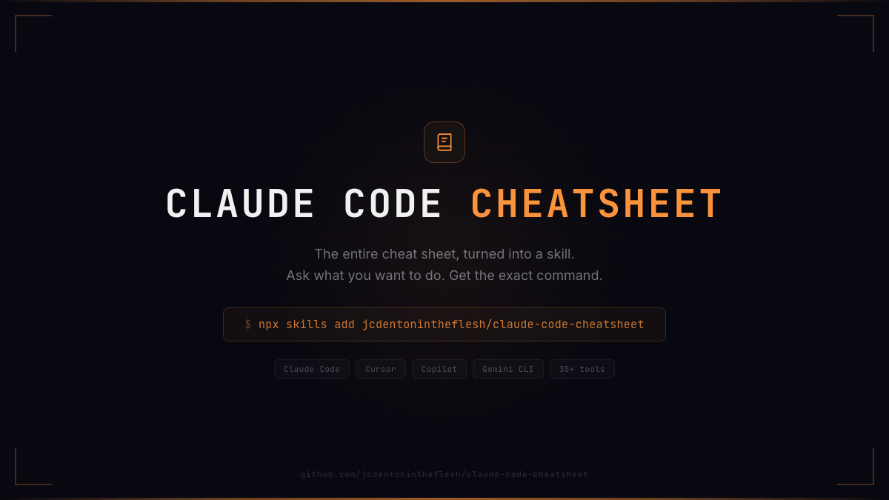
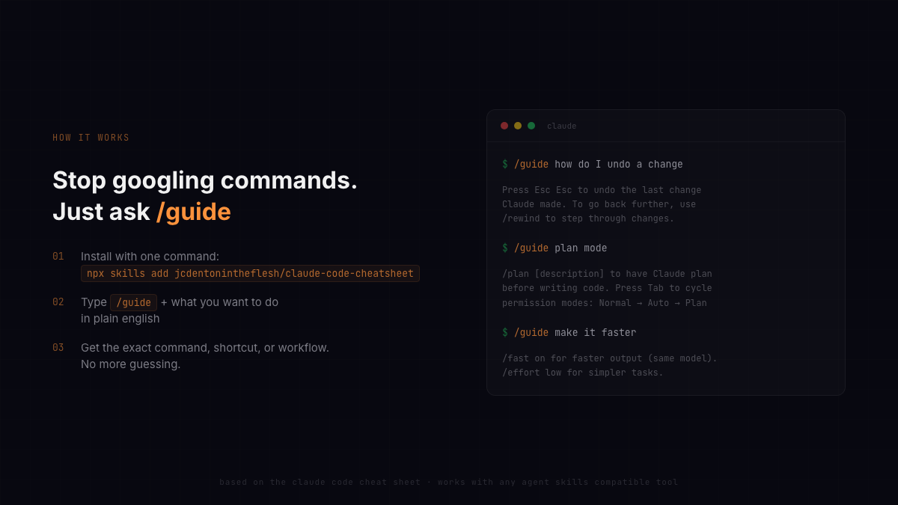

<p align="center">
  
</p>

# claude-code-cheatsheet

The [Claude Code cheat sheet](https://x.com/jcdentonthefres), turned into a skill you can install in one line.

Ask what you want to do in plain english. Get the exact command. No more googling, no more guessing, no more Claude hallucinating commands that don't exist.

<p align="center">
  
</p>

## Install

```bash
npx skills add jcdentonintheflesh/claude-code-cheatsheet
```

That's it. Now you have `/guide`.

## Usage

```
/guide                              show me the basics
/guide how do I search my codebase  get the exact command
/guide what are worktrees           learn a feature
/guide plan mode                    understand a workflow
/guide keyboard shortcuts           see all shortcuts
/guide undo                         fix a mistake
```

Also kicks in automatically when you ask "how do I..." questions about Claude Code.

## What's in it

The full cheat sheet baked into a skill. Every slash command, keyboard shortcut, CLI flag, workflow, config option, and troubleshooting tip. Instead of staring at a giant image trying to find what you need, just ask.

## Works with

Follows the [Agent Skills](https://agentskills.io) standard. Works across Claude Code, Cursor, Copilot, Gemini CLI, and any other compatible tool.

## Credit

Based on the [Claude Code Cheat Sheet](https://cc.storyfox.cz/) by [@phasE89](https://x.com/phasE89).

## License

MIT
